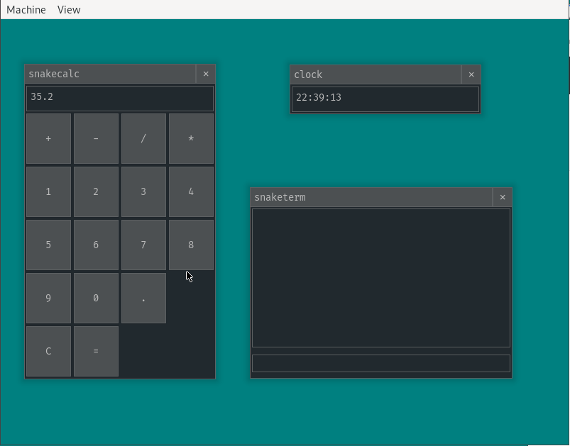

# snakeware
snakeware is a free Linux distro with a Python userspace inspired by the Commodore 64. You are booted directly into a
Python interpreter, which you can use to do whatever you want with your computer.



## Motivation
The idea is that a Python OS would be fun to use and very easy to contribute to. Even relative beginners might be able
to find ways to meaningfully contribute apps and other code to this distro.

Our window manager, snakewm, is based on pygame/pygame_gui. We do not use X11; snakewm draws directly to `/dev/fb0`.

We also are not going to be using any other huge and opaque software such as systemd, etc. The goal is to eventually
have a usable set of userspace apps and utilities written entirely in Python, because Python is fun and it Just Werks™.

## Running
Download the latest release image (when one comes out).

Then, burn the image file to a flash drive and boot it, or launch it in QEMU with this command:

`qemu-system-x86_64 -drive format=raw,file=snakeware.img -m 2048`

Once you are booted into the Python environment, launch snakewm with these commands:
```
>>> from snakewm.wm import SnakeWM
>>> SnakeWM().run()
```

We are working on an app menu, but in the meantime you can load existing apps with these hotkeys:

* `ALT+H` - very basic "Hello World" app
* `ALT+P` - Pong game

## Building
If you want to generate your own snakeware image, clone this repository and run `./build_all.sh` in the `snakeware/`
directory. This will take a long time, because Linux, Python, and Busybox are all built from source. Take a look
at the build scripts beforehand to verify that you have everything you need to build it. In general, if you have
Python, pygame, pygame_gui, and all of the Linux kernel's build dependencies installed, you should be good to go.

The build scripts currently steal shared object files from the host system to pack into the distro image. In the future,
we will likely build these libraries from source instead of copying them from the host.

**NOTE:** If you are only contributing apps or other code to snakewm, you don't need to build a whole snakeware distro 
image to test your changes. Simply make your changes to snakewm then run `sudo python wm.py` in the `snakewm/` 
directory. snakewm will then start drawing itself directly to the framebuffer and you can test out your changes. 
Press `ALT+ESC` to return to your normal desktop.

## Contributing
Developers of all experience levels are welcome and encouraged to contribute to snakeware. Python enthusiasts that are
familiar with pygame and pygame_gui will be able to write their own snakeware apps very easily. See existing apps
in `snakewm/apps/` for examples of how to get started, and feel free to ask questions if you need help.

Those with experience building Linux systems are encouraged to contribute to the underlying aspects of the distro,
such as the build/package scripts and configuration for the kernel, GRUB, etc. The build system is currently not
very streamlined or robust, and I am sure that there are better ways to do a lot of it.

I would also like to eventually stop using Busybox for intialization and find a way to perform all necessary init from
the Python environment, so ideas about that are welcome.

## TODO
This is an abridged list of future plans:

* Many more snakewm apps
* App menu for choosing apps to run
* Improved/streamlined build system
* Improved kernel config
* Take advantage of pygame_gui's theme functionality
* Dynamic/interactive desktop backgrounds
* Sound support
* Networking -> web browser
* Ditch busybox, init via Python somehow
* ...
